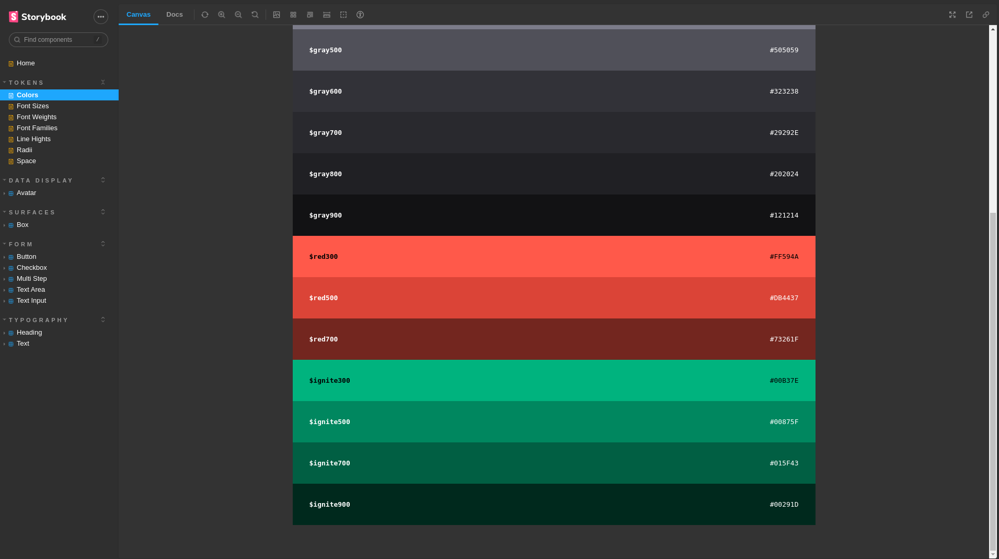
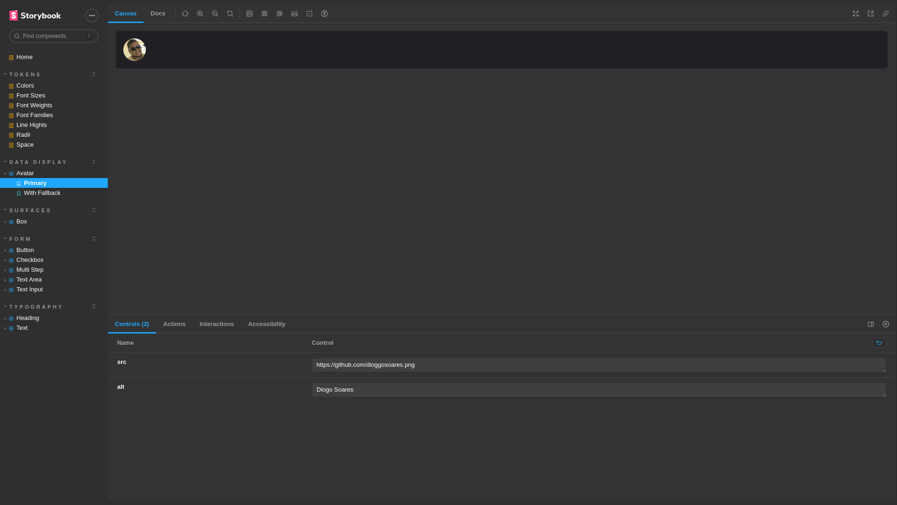
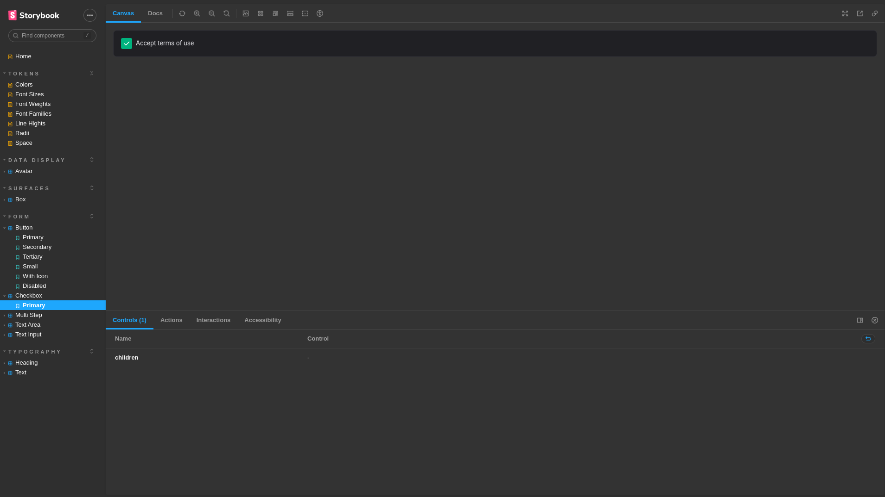
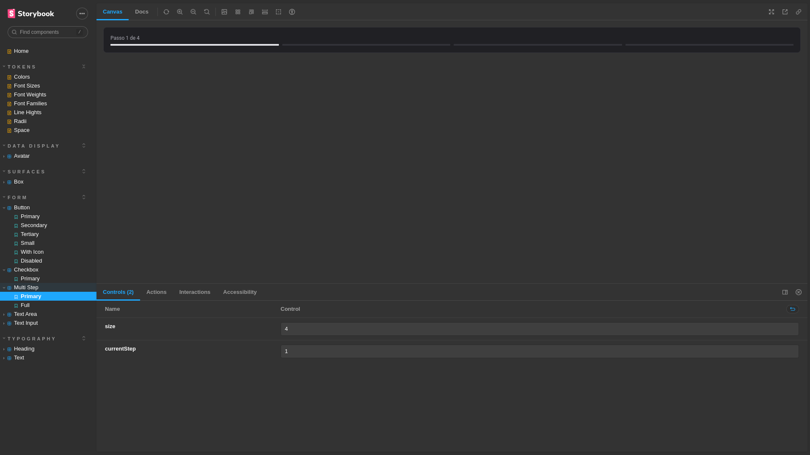
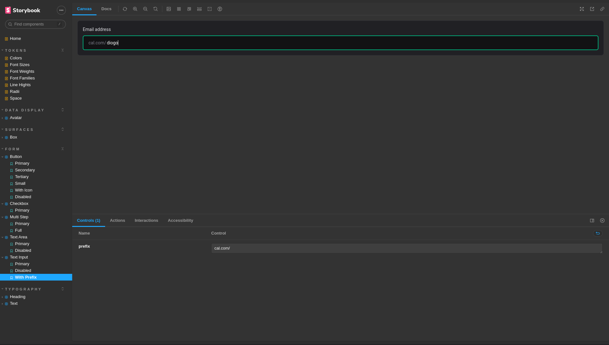

 

# Components

- [ ] Text
- [ ] Heading
- [ ] Box
- [ ] Button
- [ ] TextInput
- [ ] TextArea
- [ ] Checkbox
- [ ] Avatar
- [ ] MultiStep

## 📄 Descrição

Projeto desenvolvido com intuito de criar um design system e uma documentação de componentes reutilizáveis.
Projeto feito com ReactJS, ViteJs, Storybook, Stitches, Radix UI e TurboRepo

## 🛠 Technologies

![react][react] ![vite][vite] ![storybook][storybook] ![turborepo][turborepo] ![stitches][stitches] ![radix ui][radix]

## 📷 Screenshots

## 🦾 Sobre mim

[react]: https://img.shields.io/badge/react%20js-1E4174?style=for-the-badge&logo=react&logoColor=white&labelColor=81D8F7

[vite]: https://img.shields.io/badge/vite%20js-1E4174?style=for-the-badge&logo=vite&logoColor=white&labelColor=FFD028

[storybook]: https://img.shields.io/badge/storybook-1E4174?style=for-the-badge&logo=storybook&logoColor=white&labelColor=FF4785

[turborepo]: https://img.shields.io/badge/turborepo-1E4174?style=for-the-badge&logo=turborepo&logoColor=white&labelColor=7265C8

[stitches]: https://img.shields.io/badge/stitches-1E4174?style=for-the-badge&logo=stitches&logoColor=white&labelColor=2C2250

[radix]: https://img.shields.io/badge/radix%20ui-1E4174?style=for-the-badge&logo=radixui&logoColor=white&labelColor=81D8F7

